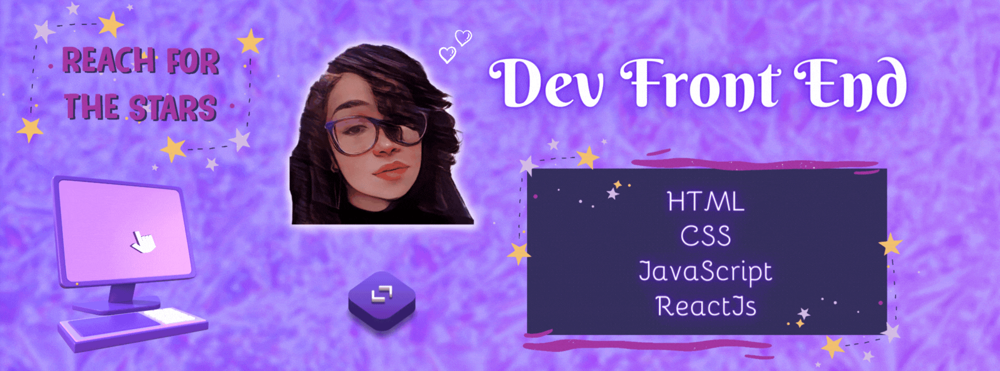

<h1 align="center">👾 Lorena Cardoso 👾</h1>

<h3 align="center">💫 Futura Desenvolvedora Front-End >>> React // React Native 💫</h3>

## GitHub 💻

  <a href="https://github.com/LorenaCardosoSanches">
  
  

  

## Sobre mim 💜

 ◈ Sou estudante de Ciência da Computação no [Centro Universitário FEI](https://portal.fei.edu.br/)
 
 ◈ No momento estou estudando para me tornar uma Desenvolvesora Front-End com especialização em React e React Native, sempre gostei da parte visual e esse é o meu foco na programação
 
 ◈ Atualmente estou fazendo um curso profissionalizante de Suporte de TI, oferecido pela Google na plataforma Coursera

## Skills 👩🏻‍💻

## Fale Comigo 💌

